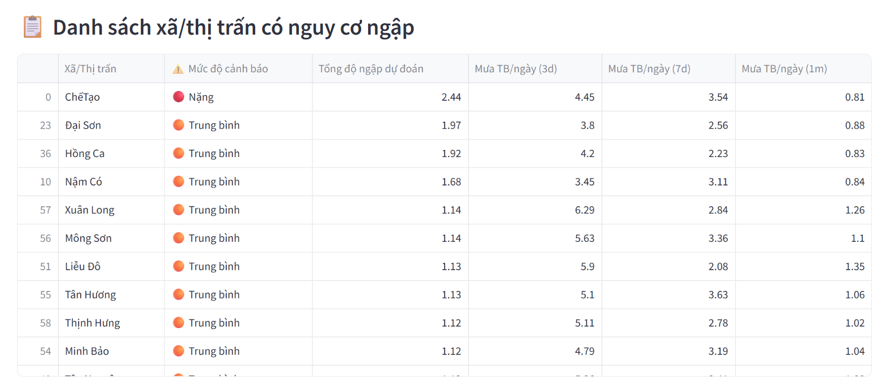

# 🌊 Flood Prediction Project - Yen Bai, Vietnam

This project aims to forecast and warn about flooding in Yen Bai province using meteorological, topographical, and hydrological data. The system includes:

- ✅ Dagster pipeline: data processing, clustering, training, and prediction.
- 🧠 Deep learning model: GNN-CNN-LSTM.
- 🌐 Streamlit application for visualizing rainfall data nationwide and flood warnings in Yen Bai.

---

## ⚙️ Installation

```bash
# 1. Clone the project
git clone https://github.com/your-username/flood_project.git
cd flood_project

# 2. Create a virtual environment (optional)
python -m venv venv
venv\Scripts\activate           # On Windows
source venv/bin/activate        # On macOS/Linux

# 3. Install dependencies
pip install -r requirements.txt
```

---

## 🔁 Data Processing Pipeline (Dagster)

The pipeline is implemented using Dagster with `@asset` and `@job`:

### 📦 Main assets (in `assets/`)

| Asset name                | Description                                      |
| ------------------------- | ------------------------------------------------ |
| `ggee_get_flood_data.py`  | Fetch rainfall data from GEOGloWS, Earth Engine  |
| `data_loading.py`         | Load and normalize input data                    |
| `preprocessing.py`        | Normalize and create GNN/CNN tensors             |
| `combine_csv.py`          | Combine data from flood events                   |
| `run_similar.py`          | Find events that share similarities with Vietnam |
| `water_cluster.py`        | Cluster regions with permanent water             |
| `training.py`             | Train the GNN-CNN-LSTM model                     |
| `model.py`                | Deep learning model definition                   |
| `evaluation.py`           | Model evaluation                                 |
| `predict_yenbai.py`       | Predict flood points in Yen Bai                  |
| `rain_yenbai.py`          | Fetch rainfall data for Yen Bai                  |
| `utils.py`                | Shared utility functions                         |

### 🧩 Jobs (in `jobs/`)

| Job            | Purpose                                 |
| -------------- | --------------------------------------- |
| `data_job.py`  | Run the entire data processing pipeline |
| `model_job.py` | Run model training and prediction       |

To launch the Dagster UI:

```bash
dagster dev
# Access: http://localhost:3000
```

---

## 📊 Data

### `data/raw/`

* `flood_data.csv`: Original flood data
* `diaphantinh.geojson`: Administrative boundaries

### `data/intermediate/`

* `.csv` files for individual flood events and clustering results
* `yenbai_rainfall.csv`: Rainfall data for Yen Bai
* `yenbai_final.csv`: Geographic information for Yen Bai
* `water_clusters.csv`: Water region clusters

### `data/final/`

* `best_cnn_gnn_model.pth`: Trained model
* `yenbai_predictions_clean.csv`: Flood prediction results

---

## 🌐 Streamlit Application

Below are some screenshots of the application's main features:

**1. National Weather Forecast Map**


*Shows the weather forecast map of Vietnam with rainfall warning areas highlighted.*

**2. Rainfall Warning by District (Yen Bai)**


*Displays rainfall warnings by district in Yen Bai province, along with a table of rainfall statistics.*

**3. List of Communes/Towns at Risk of Flooding**



*Lists communes/towns with flood risk levels and predicted flood metrics.*

**4. Flood Risk Map with Details**


### 1️⃣ `app.py` – **Nationwide Rainfall Map**

* Displays weather layers and rainfall from GEOGloWS.
* Allows selection of area and map base layer.
* For users to observe overall weather.
* Weather information table for a specific province for the next 5 days.

```bash
cd APP/vn_web
streamlit run app.py
```

---

### 2️⃣ `rain_yenbai.py` – **Flood Warning for Yen Bai**

* Map interface for flood warnings in Yen Bai.
* Select threshold, display terrain, water, and flood clusters.
* Information about communes/towns with 3 warning levels.
* Input data from `yenbai_predictions_clean.csv`.

```bash
cd APP/yenbai_app
streamlit run rain_yenbai.py
```


